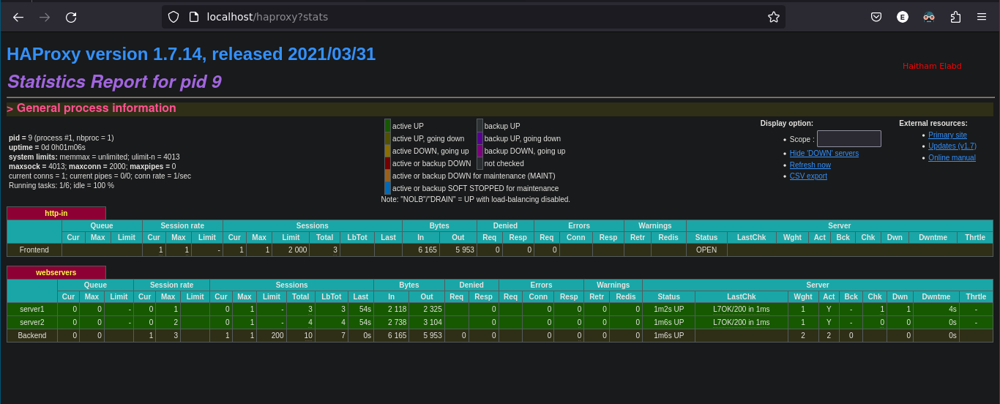

# HAProxy Load Balancer with Docker Compose

This repository demonstrates how to create a simple load balancer using HAProxy and Docker Compose. The setup includes two Apache backend servers that are load balanced by HAProxy.

## Prerequisites

Make sure you have Docker and Docker Compose installed on your system.

## Usage

1. Clone this repository:

    ```bash
    git https://github.com/h3itham/LoadBalancer-HAProxy-Apache
    cd  LoadBalancer-HAProxy-Apache 
    ```

2. Run Docker Compose to start the containers:

    ```bash
    docker-compose up -d
    ```

3. Access the HAProxy stats page:
   
   Open a web browser and go to `http://localhost/haproxy?stats` (username: `admin`, password: `P@ssw0rd`). This will show the HAProxy statistics page where you can monitor the load balancing.

   


4. Access the application:

   Open a web browser and go to `http://localhost` multiple times. You should see responses from both Apache backend servers indicating the load balancing.

## Configuration

- `docker-compose.yml`: Contains the configuration for the HAProxy load balancer and two Apache backend servers.
- `haproxy.cfg`: Configuration file for HAProxy.


## Customize

Feel free to modify the configurations according to your requirements. You can adjust HAProxy settings, add more backend servers, or configure Apache as needed.

## Notes

- This setup is for demonstration purposes and may need adjustments for production use.
- Ensure proper security measures are implemented in a production environment.


